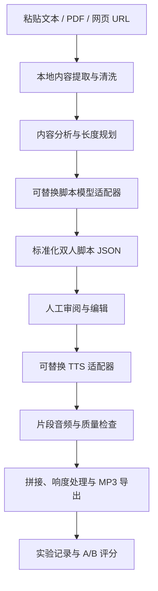

# Red014.Podcast 产品需求文档

> 文档状态：实验版 PRD  
> 更新日期：2026-06-25  
> 产品阶段：个人使用的技术可行性验证  
> 核心方案：DeepSeek/Claude 生成双人脚本，火山引擎语音播客大模型生成双人语音；OpenAI、Hermes、Gemini 作为可替换模型

## 1. 项目概述

Red014.Podcast 是一个在本地运行的 Web 工具。用户导入文章、文字型 PDF 或网页链接后，系统将原始内容改编成自然的双人对谈脚本，再生成可试听、可下载的播客音频。

本项目当前只服务作者本人，用于验证以下核心假设：

1. 长文章能否稳定改编成有信息密度、听感自然的双人对谈。
2. 现有语音模型能否生成接近真人播客的中文双人音频。
3. 一期 8–15 分钟的播客能否在可接受的时间和 API 成本内完成。
4. Claude、OpenAI、Hermes 等模型能否通过统一接口互换并进行效果对比。

项目不以商业化、规模化或公开发布为当前目标。

## 2. 原始需求

- 输入内容：
  - 手动粘贴文本，包括公众号正文。
  - 上传文字型 PDF。
  - 输入普通网页文章链接。
- 输出内容：
  - 一段约 8–15 分钟的中文播客。
  - 采用两人交流形式。
  - 两位说话者可以选择不同音色。
  - 对话应自然、有节奏，尽量降低明显的 AI 合成感。
  - 支持试听和导出 MP3。

## 3. 产品目标与非目标

### 3.1 本阶段目标

- 跑通从内容导入到 MP3 导出的完整流程。
- 验证三类输入的稳定性：粘贴文本、文字型 PDF、网页文章。
- 建立标准化双人脚本格式，使脚本模型与 TTS 服务可以独立替换。
- 支持在生成音频前人工编辑脚本。
- 支持局部重新生成脚本或音频，避免每次从头运行。
- 记录每次实验使用的模型、参数、耗时、成本和主观评分。
- 使用同一篇文章对不同脚本模型和语音方案进行 A/B 测试。

### 3.2 非目标

- 用户注册、权限、团队协作和云端多租户。
- 支付、订阅、额度管理和商业化定价。
- 自动发布至小宇宙、Spotify、Apple Podcasts 等平台。
- 自动抓取受登录、验证码或强反爬保护的公众号页面。
- 扫描版 PDF 的 OCR。
- 声音克隆、真人冒充或未经授权使用他人音色。
- 大规模批量生产和高并发任务调度。
- 在首版加入背景音乐、音效、片头广告和复杂后期制作。

## 4. 成功标准

本项目是实验，不应使用“完全听不出是 AI”作为绝对验收条件。该目标主观且受音色、文本、语言、设备和听众经验影响。首版使用以下可测标准：

| 维度 | 验收目标 |
|---|---|
| 流程完整性 | 三类输入均可完成“导入 → 脚本 → 音频 → MP3” |
| 内容忠实度 | 不新增关键事实；抽查核心观点无明显歪曲 |
| 脚本可用性 | 80% 以上台词无需重写即可进入 TTS |
| 音频可懂度 | 无大段漏读、重复、截断或无法理解的发音 |
| 对话自然度 | 作者主观评分达到 4/5，明显机械停顿不超过 3 处/10 分钟 |
| 生成时长 | 10 分钟成品在 15 分钟内生成，具体受供应商限速影响 |
| 可修复性 | 能针对单个片段修改脚本并重新生成，不必重跑整期 |
| 可替换性 | 至少成功接入两个脚本模型，并输出相同结构的脚本 JSON |
| 可观测性 | 每次任务可查看模型、耗时、字符数、音频时长、错误和估算成本 |

## 5. 目标用户与使用场景

### 5.1 目标用户

当前唯一目标用户为项目作者本人。

### 5.2 核心场景

1. 将一篇公众号长文粘贴到工具中，生成适合通勤收听的双人播客。
2. 上传一份文字型 PDF，将其中的核心内容转成 8–15 分钟对谈。
3. 输入普通网页文章 URL，自动提取正文并生成播客。
4. 使用同一份原文比较 Claude、OpenAI 和 Hermes 的脚本效果。
5. 修改人名读音、语气或某段台词后，仅重新生成对应音频片段。

## 6. 能力基准与竞品分析

由于项目只用于个人实验，本节不评估市场规模和商业机会，而是比较现有产品已经证明的能力、可复用部分和自建价值。

### 6.1 NotebookLM Audio Overviews

**已验证能力**

- 可基于用户提供的资料生成由两位 AI 主持人讨论的 Audio Overview。
- 支持 PDF、网页、文本等多种来源。
- 产品体验接近“导入资料后直接获得播客”，证明需求和技术路径可行。

**优势**

- 端到端体验成熟，几乎没有配置成本。
- 对资料理解、结构组织和双人讨论的结合度高。
- 适合作为最终听感和内容结构的主要参照物。

**局限**

- 脚本、分段、音色和生成参数的控制有限。
- 不适合研究各处理阶段的差异。
- 难以自由替换模型或只重新生成某个片段。
- 对自动化导出、实验记录和可复现性支持不足。

**对本项目的启示**

Red014.Podcast 不应只复制“一键生成”，而应重点提供脚本可编辑、模型可替换、局部重生成和实验记录。

### 6.2 火山引擎语音播客大模型

**已验证能力**

- 火山引擎（字节跳动）提供专门的语音播客大模型，端到端将文本转为双人对话音频。
- 基于 S2S（Speech-to-Speech）多模态预训练，实现"大脑（LLM）+ 嘴巴（TTS）"深度协同。
- 原生支持中文，融入真人播客的自然附和、口语停顿、"嗯"声及呼吸感等细节。
- 提供三种生成模式：长文/链接总结（action=0）、直接对话文本（action=3）、联网搜索（action=4）。
- 内置配对的播客音色（如咪仔/大乙先生、刘飞/潇磊），也支持自定义 TTS 音色和声音复刻。

**优势**

- **原生双人对话**：不需要按说话者分段调用再拼接，API 直接输出完整双人播客音频。
- **中文优先**：专为中文播客场景设计，听感远超通用 TTS 拼接方案。
- **效率极高**：单次 WebSocket 调用即出成品，无 FFmpeg 拼接环节。
- **成本可控**：国内服务按字符计费，人民币结算，延迟低。

**局限**

- 仅支持通过 WebSocket v3 协议接入，无 REST API。
- 内置播客音色数量有限（2-3 对预配对），自定义 TTS 音色需在同一火山引擎 APPID 下配置。
- action=3（直接对话）模式需传入已编排好的对话轮次（`nlp_texts`），不做自动脚本优化。
- 单次文本总长度有限制（≤10000 字符），超长脚本需分段提交。

**对本项目的启示**

火山引擎播客大模型 action=3 模式完美匹配 Red014 的"脚本→音频"流程：将已生成的 PodcastScript JSON 直接映射为 `nlp_texts` 参数，无需手动按说话者分离、分段生成和拼接。这大幅简化架构：省去 FFmpeg 拼接模块，也无需处理片段边界衔接问题。

#### 6.2.1 与火山引擎原生播客（action=0）的差异化

火山引擎的 action=0（长文总结模式）与 Red014 表面上功能重叠——都是"文章进，播客出"。但产品定位完全不同，不存在替代关系：

| 维度 | 火山引擎 action=0 | Red014.Podcast |
|---|---|---|
| **角色** | 端到端黑盒产品 | 脚本工作台 + TTS 适配层 |
| **脚本生成** | 不可控，不可编辑 | **完全可控**：选模型、调 prompt、人工编辑、A/B 对比 |
| **事实准确性** | 无法验证，可能编造 | 每句话关联原文 source_claim，可追溯审计 |
| **角色设计** | 固定配对，无法自定义 | 自定义角色性格、口吻、功能分工 |
| **局部修改** | 改一个字 → 全部重新生成 | 只重新生成受影响的片段 |
| **成本透明度** | 不透明 | 每一步 token/字符数、耗时、费用全记录 |
| **模型自由度** | 绑定火山引擎 | Claude / DeepSeek / OpenAI / Hermes 可替换 |
| **实验能力** | 无 | 同篇文章多模型 A/B 评分对比 |

**结论：火山引擎播客是 Red014 的 TTS 供应商，不是竞品。** Red014 的创新点不在"把文章变成音频"，而在于：

1. **脚本质量可控**——不信任黑盒生成的对话，自己编排、审查、迭代
2. **事实可审计**——每句台词挂载原文出处，杜绝"听起来有道理但不知道真假"
3. **片段级迭代**——改一句话只重录 30 秒，而不是整期 12 分钟
4. **多模型实验平台**——同一篇文章跑 Claude 和 DeepSeek，用数据说话

火山引擎原生播客的存在反而是红利：Red014 不需要自己写 TTS 适配器和 FFmpeg 拼接了，专注做好脚本层和实验层的差异化。

### 6.3 Wondercraft

**已验证能力**

- 提供从脚本或内容到播客音频的创作工作流。
- 强调音色、脚本编辑、音乐和后期制作。

**优势**

- 展示了完整 AI 音频工作台的交互方式。
- 脚本编辑、试听和音频编排值得参考。

**局限**

- 对本项目而言功能过重。
- 端到端平台不利于底层模型对比。
- 商业产品的编辑能力不是个人技术实验的必要前提。

**对本项目的启示**

首版只吸收“脚本先审后生成”“片段级试听和重生成”，不建设完整音频工作站。

### 6.4 OpenAI

**适用环节**

- 使用 Responses API 进行文章理解和结构化脚本生成。
- 使用文件输入处理 PDF，或接收本地提取后的纯文本。
- 使用 TTS 作为备选语音方案。

**优势**

- 结构化输出和开发工具成熟。
- 适合作为 Claude 的脚本质量对照。
- 同一供应商可覆盖文本和语音。

**局限**

- OpenAI TTS 更适合按说话者、按片段生成后拼接；双人连续互动的表现需要单独验证。
- Codex 的主要定位是编程代理，不应被设计为生产环境中的内容生成运行时。
- ChatGPT/Codex 个人订阅不等于 API 额度。

### 6.5 Claude

**适用环节**

- 长文章理解、内容提炼和播客脚本改编。
- 直接理解 PDF，或接收本地抽取后的文本。
- 通过 Web Fetch 或本地正文提取结果理解网页内容。

**优势**

- 长文本分析和写作能力适合作为默认脚本模型。
- 容易通过提示词控制事实边界、角色风格和对话结构。
- 可稳定输出结构化 JSON，便于后续 TTS 和局部编辑。

**局限**

- Claude 本身不提供本项目所需的完整 TTS 输出链路。
- 仍可能产生事实扩写、过度总结、角色口吻趋同等问题。
- Claude 个人订阅不等于 Anthropic API 额度。

### 6.6 Hermes

“Hermes”可能指不同的模型、代理或接入平台。本 PRD 将其视为一个可选的 OpenAI-compatible 文本模型端点。

接入前提：

- 提供可由本地程序访问的 API。
- 支持足够长的上下文。
- 能稳定生成符合 JSON Schema 的结果，或可通过解析和重试修复。
- 提供明确的模型名称、鉴权方式、限流和费用信息。

Hermes 可以替代 Claude/OpenAI 完成脚本生成，但不能自动替代 TTS。若实际使用的 Hermes 产品不提供兼容 API，则不纳入首版。

### 6.7 结论

现成产品已经证明“文档转双人播客”可行。自建的价值不在于抢占市场，而在于：

- 控制脚本改编过程。
- 自由比较 Claude、OpenAI、Hermes 和 Gemini。
- 选择并更换 TTS。
- 修复单个片段。
- 记录真实成本、耗时和质量。

## 7. 推荐技术方案

### 7.1 总体架构



### 7.2 默认供应商组合

| 环节 | 默认方案 | 备选方案 |
|---|---|---|---|
| 本地开发 | Codex 辅助开发 | Claude Code、人工开发 |
| 文本/PDF/网页提取 | 本地解析 | 模型原生文件或 URL 输入 |
| 脚本生成 | Claude API | OpenAI API、Hermes、Gemini |
| 双人语音 | 火山引擎语音播客大模型（action=3） | OpenAI TTS 分段拼接、Gemini 多说话人 TTS |
| 音频处理 | 火山引擎直接输出 MP3 | FFmpeg 拼接、音频处理库 |
| 运行界面 | 本地 Next.js Web 应用 | Gradio/Streamlit 快速原型 |
| 任务存储 | 本地文件 + JSON manifest | SQLite |

### 7.3 为什么默认选择 Claude，而不是 Gemini

- 项目主要难点是把长文改成自然、忠实、可听的脚本，Claude 更符合作者现有使用习惯。
- PDF 首版仅支持文字型文件，可由本地工具抽取，不依赖 Gemini 的原生多模态 PDF 能力。
- 网页正文也可以本地提取，不需要依赖 Gemini URL Context。
- 脚本模型被适配器隔离，后续比较 Gemini 不需要修改整个流程。

Gemini 仍保留为备选，因为它可覆盖文档理解和多说话人语音，适合测试单供应商链路。

### 7.4 为什么 Codex 不直接负责运行时脚本生成

Codex 用于阅读、编写和维护代码。运行时产品应调用稳定、可计费、可记录版本的模型 API。将 Codex 交互会话作为生产链路会导致：

- 难以从本地 Web 应用稳定调用。
- 模型和会话状态不可控。
- 难以记录每次生成的参数、成本和结果。
- 个人订阅与 API 计费边界不清晰。

因此，Codex 是开发工具，不是本产品的内容服务依赖。

## 8. 功能需求

### 8.1 内容导入

#### FR-01 粘贴文本

- 提供标题和正文输入框。
- 标题可选；未填写时由模型建议标题。
- 显示字符数和预估播客时长。
- 支持中文和包含少量英文的文章。

#### FR-02 上传文字型 PDF

- 支持单个 PDF 上传。
- 本地提取文本，不进行 OCR。
- 如果提取结果过短或为空，应提示该文件可能是扫描件。
- 显示提取后的文本，允许用户清理页眉、页脚和乱码。
- 首版不要求还原复杂表格、公式和多栏排版。

#### FR-03 导入网页文章

- 用户输入 HTTP/HTTPS URL。
- 服务端获取页面并提取标题、正文和基础元数据。
- 去除导航、广告、推荐列表和评论。
- 抓取失败时显示原因，并允许用户转为手动粘贴。
- 对公众号等强限制页面，不承诺自动抓取成功。

#### FR-04 内容清洗

- 合并异常换行和空白。
- 尝试移除重复页眉页脚。
- 保留标题、章节和列表结构。
- 在进入模型前显示最终输入文本。

### 8.2 播客规划

#### FR-05 自动时长

- 默认目标时长为 8–15 分钟。
- 根据原文长度、信息密度和模型建议自动选择目标时长。
- 用户可以在生成前覆盖目标时长。
- 估算可先按中文语速约 220–300 字/分钟校准，最终值由真实音频反推。

#### FR-06 内容边界

- 默认允许重排原文结构、压缩重复内容、增加自然过渡和对话性表达。
- 不允许新增原文没有支持的关键事实。
- 模型补充的解释如果不能从原文推出，应显式标记，默认不进入最终脚本。
- 保留原文主要论点、关键例子、结论和必要限定条件。

### 8.3 双人脚本生成

#### FR-07 角色设定

默认角色：

- 主持人 A：负责推进话题、提问、总结和控制节奏。
- 主持人 B：负责解释、回应、举例和提出有限质疑。

要求：

- 两个角色的句式、观点功能和语气应有区别。
- 避免每段都使用“是的”“没错”“非常有意思”等模板化回应。
- 避免把原文机械拆成一问一答。
- 可加入简短开场和收束，但不加入冗长片头。

#### FR-08 结构化脚本

脚本模型必须输出标准 JSON。建议结构：

```json
{
  "title": "播客标题",
  "summary": "本期摘要",
  "target_duration_minutes": 10,
  "source_claims": [
    {
      "id": "claim-001",
      "text": "原文中的关键事实或观点"
    }
  ],
  "segments": [
    {
      "id": "seg-001",
      "topic": "开场",
      "turns": [
        {
          "id": "turn-001",
          "speaker": "A",
          "text": "台词内容",
          "delivery": "自然、简短",
          "source_claim_ids": ["claim-001"]
        }
      ]
    }
  ]
}
```

`source_claim_ids` 用于追踪台词依据。首版可允许为空，但关键事实必须尽量关联来源。

#### FR-09 脚本审阅和编辑

- 显示完整脚本。
- 支持编辑单句台词。
- 支持调整说话者。
- 支持删除、增加和排序片段。
- 支持仅重新生成某个片段。
- 生成音频前必须由用户主动确认脚本。

#### FR-10 模型切换

- 支持 Claude 和 OpenAI 两个首批适配器。
- Hermes 在 API 条件确认后接入。
- Gemini 作为可选对照。
- 每次生成记录供应商、模型 ID、提示词版本和主要参数。

### 8.4 音频生成

#### FR-11 音色选择

- 分别为 A、B 选择音色。
- 保存最近使用的音色组合。
- 提供短句试听。
- 不允许默认提供未经授权的真人声音克隆。

#### FR-12 分段生成

- 按 segment 生成音频，不一次提交整期。
- 单段失败时自动重试，不能影响已成功片段。
- 支持对单个 segment 重新生成。
- 每个音频片段与脚本版本绑定，脚本改变后标记为过期。

#### FR-13 音频后处理

- 使用 FFmpeg 拼接片段。
- 统一采样率、声道和编码格式。
- 进行基础响度归一化，降低片段音量跳变。
- 在段落之间加入可配置的短停顿。
- 导出 MP3；可保留 WAV 中间文件用于排查。

#### FR-14 试听和导出

- 支持整期播放、暂停和拖动。
- 支持按 segment 试听。
- 导出 MP3、脚本 Markdown、脚本 JSON 和任务 manifest。

### 8.5 实验记录

#### FR-15 任务记录

每个任务保存：

- 原始内容及来源类型。
- 清洗后的文本。
- 脚本 JSON 和修改历史。
- 所用模型与参数。
- 音色和 TTS 配置。
- 每一步耗时、重试次数和错误。
- 输入/输出 token 或字符数。
- API 返回的费用信息；若无，则使用本地估算。
- 最终音频和用户评分。

#### FR-16 A/B 对比

- 可以基于同一原文复制任务。
- 支持更换脚本模型或 TTS 后重新运行。
- 显示两版脚本和核心指标。
- 用户可分别评价忠实度、自然度、信息密度、角色差异和音频听感。

## 9. 非功能需求

### 9.1 隐私

- 所有任务和文件默认保存在本机。
- 只有生成所必需的内容会发送到所选 API。
- 页面明确显示当前会把哪些数据发送给哪个供应商。
- API Key 只保存在本地环境变量或系统密钥存储中，不写入任务文件。

### 9.2 稳定性

- 所有外部调用必须设置超时和有限重试。
- 任务应支持从失败步骤恢复。
- 已成功生成的脚本和音频片段不得因后续失败丢失。

### 9.3 可维护性

- 内容导入、脚本生成、TTS、音频处理必须是独立模块。
- 供应商适配器使用统一接口。
- 提示词带版本号，并随任务记录。
- 不在业务代码中硬编码 API Key、模型名称和音色 ID。

### 9.4 本地运行

- 首版只需支持作者当前使用的 macOS。
- 使用本地浏览器访问，例如 `http://localhost:3000`。
- 依赖 FFmpeg；安装状态应在启动时检查。

## 10. 建议界面

### 10.1 页面一：新建任务

1. 选择输入类型：文本、PDF、网页。
2. 导入并预览清洗后的正文。
3. 选择脚本模型。
4. 选择目标时长或保持自动。
5. 点击“生成脚本”。

### 10.2 页面二：脚本工作台

- 左侧显示来源摘要和关键观点。
- 中间按片段显示双人脚本。
- 支持编辑、重排和局部重生成。
- 右侧显示角色、音色和生成参数。
- 确认后点击“生成音频”。

### 10.3 页面三：音频工作台

- 显示各片段状态和波形或播放器。
- 支持单段试听、重新生成和整期播放。
- 显示总耗时和估算成本。
- 导出 MP3、Markdown、JSON 和 manifest。

## 11. 技术设计

### 11.1 推荐技术栈

- Web 框架：Next.js + TypeScript。
- 本地任务目录：文件系统。
- 元数据：每个任务一个 `manifest.json`；任务增加后再迁移 SQLite。
- 网页提取：Mozilla Readability + JSDOM，必要时增加抓取降级策略。
- PDF 提取：`pdfjs-dist` 或等效 Node.js 库。
- 模型 SDK：Anthropic SDK、OpenAI SDK；Hermes 使用兼容客户端。
- TTS：火山引擎语音播客大模型 WebSocket v3 协议。
- 音频处理：FFmpeg 子进程。
- 校验：JSON Schema 或 Zod。
- 测试：Vitest；关键端到端流程可使用 Playwright。

### 11.2 模块边界

```text
src/
  importers/
    plain-text.ts
    pdf.ts
    webpage.ts
  cleaners/
    normalize.ts
  planners/
    duration.ts
    claims.ts
  providers/
    scripts/
      interface.ts
      anthropic.ts
      openai.ts
      hermes.ts
      gemini.ts
    tts/
      interface.ts
      volc-podcast.ts
      openai.ts
      gemini.ts
  podcast/
    schema.ts
    prompts/
    generation.ts
  audio/
    render.ts
    concat.ts
    loudness.ts
  jobs/
    manifest.ts
    runner.ts
  app/
```

### 11.3 脚本模型接口

```ts
interface ScriptProvider {
  generateScript(input: ScriptGenerationInput): Promise<PodcastScript>;
  regenerateSegment(input: SegmentRegenerationInput): Promise<PodcastSegment>;
}
```

所有模型都必须返回同一个 `PodcastScript` 数据结构。供应商特有参数只能留在适配器内部或任务配置中。

### 11.4 TTS 接口

火山引擎播客模型 action=3 接受对话轮次数组直接生成完整音频，因此 TTS 接口比通用方案更简洁：

```ts
interface TtsProvider {
  listSpeakers(): Promise<SpeakerPair[]>;
  renderPodcast(input: PodcastRenderInput): Promise<AudioArtifact>;
}

interface PodcastRenderInput {
  segments: PodcastSegment[];     // 脚本片段（含 turns）
  speakers: [string, string];     // 两个说话者音色 ID
  format: 'mp3' | 'ogg_opus';    // 输出格式
  speechRate?: number;            // 语速
}

interface SpeakerPair {
  name: string;                   // 配对名称（如 "咪仔 × 大乙先生"）
  speakers: [string, string];     // 两个音色 ID
}
```

播客模型原生处理双人互动（插话、附和、停顿），因此不需要按 turn 分离再拼接。如果后续接入只支持单说话者的 TTS（如 OpenAI TTS），则由适配器内部处理分段和拼接。

### 11.5 本地任务结构

```text
data/jobs/<job-id>/
  manifest.json
  source/
    original.pdf
    extracted.txt
    cleaned.txt
  scripts/
    v1.json
    v1.md
    v2.json
  audio/
    v1/
      seg-001.mp3
      seg-002.mp3
      final.mp3
```

## 12. 核心难点与可行性分析

### 12.1 总体判断

**结论：技术可行，适合作为个人实验。**

端到端链路不存在无法解决的技术障碍。真正困难的不是“生成一段音频”，而是稳定获得自然、忠实、可局部修复的中文双人内容。

| 模块 | 难度 | 可行性 | 说明 |
|---|---:|---:|---|
| 粘贴文本导入 | 1/5 | 很高 | 基础输入和长度检查 |
| 文字型 PDF 提取 | 2/5 | 高 | 多栏、页眉页脚和乱码是主要问题 |
| 普通网页正文提取 | 3/5 | 中高 | 动态页面、反爬和正文识别会失败 |
| 长文理解与压缩 | 3/5 | 高 | 需要分层摘要和事实边界 |
| 自然双人脚本 | 4/5 | 中高 | 最依赖提示词、模型和人工审阅 |
- 双人中文 TTS | 4→2/5 | 中高→高 | 火山引擎播客模型大幅降低本项难度；听感、发音、节奏仍需真实测试 |
| 分段与音频拼接 | 2/5 | 高 | 播客模型原生输出完整音频，仅超长脚本需分段 |
| 多模型适配 | 3/5 | 高 | 统一 Schema 后实现明确 |
| 局部重生成 | 3/5 | 高 | 需要版本和缓存设计 |
| 完全去除 AI 感 | 5/5 | 不可保证 | 只能持续降低，不能作为硬承诺 |

### 12.2 难点一：脚本听起来像对话，而不是摘要朗读

常见失败：

- 一人提问，另一人连续朗读原文摘要。
- 两个角色没有性格和功能差异。
- 大量使用模板化回应。
- 为了“有讨论感”而编造观点冲突。
- 开场、转折和结尾过度套路化。

实施策略：

- 先抽取关键观点和事实，再生成节目结构，最后生成台词。
- 用角色职责约束，而不是只写“轻松自然”。
- 限制单次发言长度，鼓励短回合和偶尔的长解释。
- 要求每个片段承担明确的信息任务。
- 生成后运行第二次“编辑审查”，删除套话、重复和无依据扩写。
- 始终允许人工编辑。

### 12.3 难点二：事实忠实度

播客改编会压缩和重排内容，模型可能把推测写成事实，或加入训练数据中的背景知识。

实施策略：

- 建立来源关键观点列表。
- 脚本台词尽量关联 `source_claim_ids`。
- 提示词明确禁止加入无来源支持的关键事实。
- 生成后执行“脚本对来源”审查。
- 对数字、时间、人名和引用进行单独检查。
- 对无法确认的内容删除，而不是润色后保留。

### 12.4 难点三：中文语音自然度

可能问题：

- 多音字、人名和缩写读错。
- 两个音色的语速、响度和情绪不一致。
- 分段生成后衔接突兀。
- 对话情绪过度或过于平淡。
- 标点被模型解释成不自然停顿。

实施策略：

- 建立发音替换表。
- 生成前进行 TTS 专用文本规范化。
- 片段控制在可重试的长度。
- 固定音色、稳定参数和后处理流程。
- 对片段边界加入可控停顿并统一响度。
- 用真实中文样本测试，而不是只听供应商演示。

### 12.5 难点四：长内容与时长控制

模型输出字数不等于最终音频时长，且不同音色语速不同。

实施策略：

- 首轮按目标字数生成。
- 生成少量样本音频，测出所选音色的实际字/分钟。
- 使用实际语速校准后续脚本长度。
- 音频完成后，如果时长偏差超过 20%，提供“压缩脚本”或“扩展脚本”操作。

### 12.6 难点五：网页导入

普通静态文章可通过正文提取器处理，但登录墙、JavaScript 渲染、验证码和公众号限制会造成失败。

实施策略：

- 首版优先普通公开网页。
- 服务端下载 HTML 后使用正文提取器。
- 对失败页面给出明确错误，不尝试绕过访问限制。
- 提供“复制正文后粘贴”的稳定降级路径。

## 13. 实施方案

### 阶段 0：供应商效果验证

目标：在写完整 UI 前确认最关键的质量风险。

任务：

1. 选择 3 篇不同类型的中文文章：
   - 观点评论。
   - 知识解释。
   - 包含较多人名、数字或专有名词的文章。
2. 使用 Claude 和 OpenAI 分别生成脚本。
3. 使用火山引擎语音播客大模型（action=3）从最佳脚本生成 2–3 分钟双人样本。
4. 记录忠实度、自然度、角色差异、发音问题、耗时和费用。
5. 确认火山引擎播客中文双人质量达到继续开发的最低标准。

交付：

- 6 份脚本样本。
- 至少 2 份不同音色配对的音频样本（每份 2-3 分钟）。
- 一份模型和音色评分表。

预计工作量：0.5–1 天。

### 阶段 1：命令行纵向原型

目标：不用 UI 跑通完整链路。

任务：

- 文本输入。
- Claude 脚本生成。
- JSON Schema 校验。
- 火山引擎播客（action=3）生成音频。
- MP3 导出。
- 保存 manifest。

验收：一条命令可从 `input.txt` 生成 `final.mp3`。

预计工作量：1–2 天。

### 阶段 2：本地 Web MVP

目标：形成可重复使用的个人工具。

任务：

- Next.js 本地页面。
- 文本、文字型 PDF 和普通网页导入。
- 清洗结果预览。
- 脚本生成、编辑和确认。
- 音色选择与试听。
- 分段生成、状态显示和失败重试。
- MP3、Markdown 和 JSON 导出。

预计工作量：3–5 天。

### 阶段 3：模型适配与 A/B 测试

目标：避免绑定 Claude，并形成实验比较能力。

任务：

- 接入 OpenAI 脚本适配器。
- 确认 Hermes API 后接入 Hermes。
- 可选接入 Gemini。
- 复制任务并更换模型。
- 增加评分和成本对比。

预计工作量：2–3 天。

### 阶段 4：质量优化

目标：降低 AI 感和人工返工。

任务：

- 事实审查步骤。
- 提示词版本管理。
- 发音词典。
- 时长校准。
- 局部脚本和音频重生成。
- 响度、停顿和片段边界优化。

预计工作量：2–5 天，取决于实际听感问题。

### 总体预计

- 最小技术验证：1–3 天。
- 可日常使用的本地 Web MVP：约 1–2 周的业余开发。
- 达到稳定、自然、低返工：需要持续样本测试，时间主要花在提示词、音色和音频细节上。

以上为单人开发估算，不包含等待供应商开通、额度限制和反复主观试听的时间。

## 14. 成本分析

成本由两部分组成：

1. 脚本模型：按输入和输出 token 计费。
2. TTS：通常按字符、音频时长、额度或模型套餐计费。

由于供应商价格和套餐会变化，本项目不在代码中硬编码价格。应在配置文件维护价格表，并记录查询日期。

建议每次任务保存：

```text
script_cost =
  input_tokens × input_price
  + output_tokens × output_price

tts_cost =
  billable_characters × character_price
  或 provider_reported_cost

total_cost =
  script_cost + tts_cost
```

预期上，脚本模型费用通常不是主要矛盾，双人 TTS 更可能占据大部分单期成本。必须先通过 2–3 分钟样本推算整期费用，再决定默认音色和模型。

成本控制方式：

- 本地提取 PDF 和网页，不把原始文件重复上传给多个模型。
- 缓存清洗文本、关键观点和脚本。
- 只重新生成失败或修改过的片段。
- A/B 测试先生成 2–3 分钟样本，不直接生成完整节目。
- 将高质量模型用于最终稿，将较便宜模型用于结构草稿的方案仅在效果验证后采用。

## 15. 风险与应对

| 风险 | 概率 | 影响 | 应对 |
|---|---:|---:|---|
| 火山引擎播客中文双人效果不满足预期 | 低 | 高 | 阶段 0 先验证；保留 Gemini/OpenAI TTS 适配器 |
| 脚本新增原文外事实 | 中 | 高 | 关键观点抽取、来源关联、二次事实审查、人工确认 |
| 两位角色听起来相同 | 中 | 中 | 明确角色职责、选择差异化音色、限制模板化回应 |
| PDF 提取顺序错误 | 中 | 中 | 显示提取结果；允许编辑；复杂 PDF 提示降级 |
| 网页无法抓取 | 高 | 低 | 明确失败原因并回退到粘贴正文 |
| 长音频请求失败 | 低 | 中 | 播客模型原生支持较长文本；超长时分段提交、缓存、幂等重试 |
| API 成本失控 | 低至中 | 中 | 生成前估算、单任务预算上限、片段测试 |
| 供应商接口或价格变化 | 中 | 中 | 适配器隔离、配置化模型和价格 |
| API Key 泄露 | 低 | 高 | 环境变量/系统密钥存储、日志脱敏、禁止写入 manifest |
| “不像 AI”的目标无法客观达成 | 高 | 中 | 改用评分和缺陷计数，不做绝对承诺 |

## 16. 测试方案

### 16.1 固定测试集

建立不少于 6 篇中文材料：

- 短文章、中文章、长文章各一篇。
- 观点类、知识类、叙事类各一篇。
- 一份普通文字型 PDF。
- 一个普通公开网页。
- 一篇包含人名、英文缩写和数字的文章。

### 16.2 自动测试

- 文本清洗单元测试。
- PDF 提取结果非空和基本顺序测试。
- 网页正文提取测试。
- PodcastScript Schema 校验。
- 模型输出解析失败后的修复和重试测试。
- 任务恢复和缓存测试。
- FFmpeg 拼接成功、时长非零和文件可播放测试。
- API Key 不进入日志和任务文件的测试。

### 16.3 人工评分

每个样本按 1–5 分评价：

- 内容忠实度。
- 信息密度。
- 对话自然度。
- 角色差异。
- 中文发音。
- 节奏和停顿。
- 整体收听意愿。

保留具体缺陷标签，例如：

- `hallucination`
- `repetitive-agreement`
- `same-personality`
- `wrong-pronunciation`
- `awkward-pause`
- `volume-jump`
- `segment-discontinuity`

## 17. 首版验收清单

- [ ] 可以粘贴文本并预览清洗结果。
- [ ] 可以上传文字型 PDF 并提取正文。
- [ ] 可以输入普通网页 URL 并提取正文，失败时可回退。
- [ ] Claude 可以生成符合 Schema 的双人脚本。
- [ ] OpenAI 可以通过相同接口生成脚本。
- [ ] 用户可以编辑、重排和确认脚本。
- [ ] 可以分别选择 A、B 音色并试听。
- [ ] 火山引擎播客可以按片段生成双人音频。
- [ ] 失败片段可以单独重试。
- [ ] 修改脚本后可以只重新生成受影响片段。
- [ ] 可以导出 MP3。
- [ ] 可以导出脚本 Markdown、JSON 和任务 manifest。
- [ ] 可以查看模型、耗时、字符数和估算成本。
- [ ] API Key 不出现在项目文件、日志和导出物中。
- [ ] 至少完成一组 Claude 与 OpenAI 的 A/B 实验。

## 18. 后续可能方向

只有核心实验成功后再考虑：

- 扫描 PDF OCR。
- 公众号链接自动解析。
- 背景音乐、片头和章节音效。
- 语气和节目风格模板。
- 自动生成标题、简介、时间轴和封面。
- 自动发布到播客平台。
- 接入更多本地或开源 TTS。
- 将发音词典、音色和提示词沉淀为可复用预设。

## 19. 参考资料

以下资料用于核验能力边界。供应商功能和价格可能变化，实现前应再次确认：

- [Google NotebookLM：Create an Audio Overview](https://support.google.com/notebooklm/answer/15731776)
- [NotebookLM 支持的来源类型](https://support.google.com/notebooklm/answer/16215270)
- [火山引擎语音播客大模型产品简介](https://www.volcengine.com/docs/6561/1631586)
- [火山引擎播客API-WebSocket-v3协议](https://www.volcengine.com/docs/6561/1668014)
- [Anthropic Claude PDF 支持](https://docs.anthropic.com/en/docs/build-with-claude/pdf-support)
- [Anthropic Web Fetch Tool](https://docs.anthropic.com/en/docs/agents-and-tools/tool-use/web-fetch-tool)
- [OpenAI 文件输入](https://developers.openai.com/api/docs/guides/file-inputs)
- [OpenAI Text to Speech](https://developers.openai.com/api/docs/guides/text-to-speech)
- [Gemini Speech Generation](https://ai.google.dev/gemini-api/docs/speech-generation)
- [Gemini Document Processing](https://ai.google.dev/gemini-api/docs/document-processing)
- [Mozilla Readability](https://github.com/mozilla/readability)
- [FFmpeg Documentation](https://ffmpeg.org/documentation.html)

## 20. 最终决策摘要

- 项目定位：个人使用的小型技术实验。
- 产品形态：本地 Web 应用。
- 输入：粘贴文本、文字型 PDF、普通网页文章。
- 公众号：首版以粘贴正文为主。
- 输出：自动控制在约 8–15 分钟的中文双人播客。
- 内容策略：允许重构和压缩，但不新增无来源支持的关键事实。
- 默认脚本模型：Claude API。
- 对照脚本模型：OpenAI API。
- 条件性模型：Hermes，要求存在稳定兼容 API。
- 可选模型：Gemini。
- 默认 TTS：火山引擎语音播客大模型（action=3 直接对话模式）。
- 架构原则：脚本模型和 TTS 均可替换；所有中间结果可查看、编辑和复用。
- 首要验证项：中文双人播客听感，其次是脚本自然度和事实忠实度。
